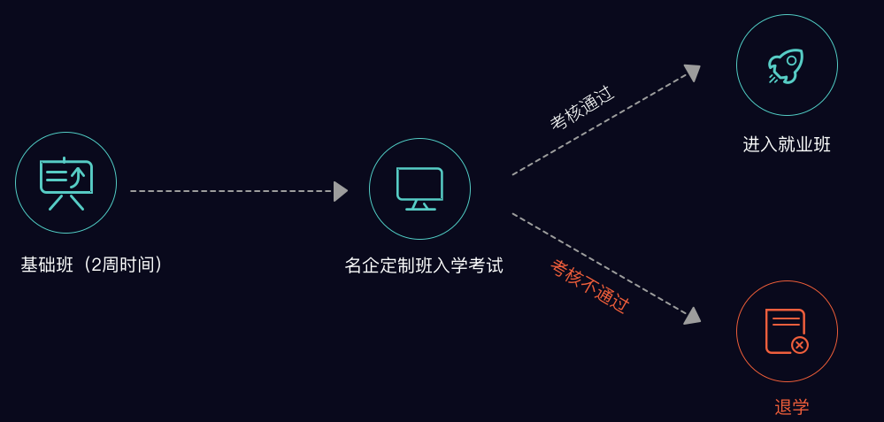

# 如何参加骑士计划

### 入学流程：

1. 提交一份入学申请书，描述自己的学习动机、目标。
2. 请告诉我们，未来3-5年内你的规划或者想做的事，并写清楚你已经为这个事做了哪些准备。
3. 老学员推荐信（若有，可优先录取。并可和引荐人各得500元奖励）
4. 我们收到您的入学申请并审核后，会向您邮寄发放预录取通知书

\* 基础班授课内容的考核  
\* 学习态度、兴趣测试、人品等因素都将作为考核内容  
\* 面试环节，由讲师1v1谈话面试  

**[ >>>入学申请](http://luffcity.mikecrm.com/V4uJVH8)**

Good luck!