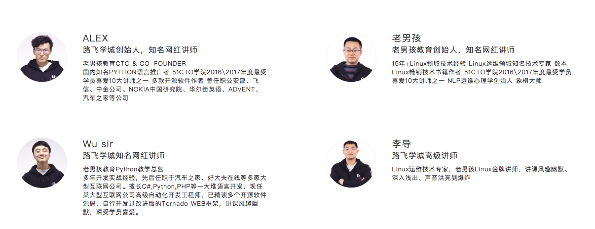
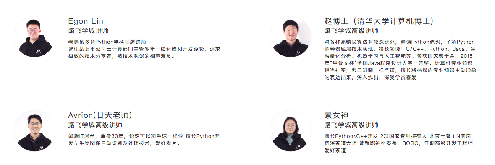

# 讲师介绍

**ALEX 老男孩教育创始人，知名网红讲师**  
老男孩教育CTO & CO-FOUNDER   
国内知名PYTHON语言推广者 51CTO学院2016\\2017年度最受学员喜爱10大讲师之一 多款开源软件作者 曾任职公安部、飞信、中金公司、NOKIA中国研究院、华尔街英语、ADVENT、汽车之家等公司  
博客：https://www.cnblogs.com/alex3714/  

**老男孩**  
老男孩教育创始人，知名网红讲师  
15年+Linux领域技术经验 Linux运维领域知名技术专家 数本Linux畅销技术书籍作者 51CTO学院2016\2017年度最受学员喜爱10大讲师之一 NLP运维心理学创始人 象棋大师  

博客：http://blog.51cto.com/oldboy  

**Wu sir**  
老男孩教育Python教学总监   
多年开发实战经验，先后任职于汽车之家、好大夫在线等多家大型互联网公司。擅长C#,Python,PHP等一大堆语言开发，现任某大型互联网公司高级自动化开发工程师，已精读多个开源软件源码，自行开发过改进版的Tornado WEB框架，讲课风趣幽默，深受学员喜爱。  
博客：https://www.cnblogs.com/wupeiqi/  

**李导**  
老男孩高级讲师  
Linux运维技术专家，老男孩Linux金牌讲师，讲课风趣幽默、深入浅出、声音洪亮到爆炸  

博客：http://blog.51cto.com/lidao  

**Egon Lin**  
老男孩教育Python学科金牌讲师   
曾任某上市公司云计算部门主管多年一线运维和开发经验，追求极致的技术分享者，被技术耽误的相声演员。  

博客：https://www.cnblogs.com/linhaifeng/  

**赵博士（清华大学计算机博士）**  
老男孩高级讲师  
对各种高精尖算法有较深研究，精读Python源码，了解Python解释器底层技术实现。擅长领域：C/C++、Python、Java、金融量化分析、机器学习与人工智能等。曾获国家奖学金，2015年“甲骨文杯”全国Java程序设计大赛一等奖。计算机专业知识相当扎实，跟二进制一样严谨，擅长将枯燥的专业知识生动形象的表达出来，深入浅出，深受学员喜爱  

**Avrion(日天老师)**  
老男孩高级讲师  
闷骚IT屌丝，单身30年，语速可以和手速一样快 擅长Python开发＼生物图像自动识别及处理技术，爱好看片。  

博客：http://www.cnblogs.com/yuanchenqi/p/6337663.html  

**景女神**  
老男孩高级讲师  
擅长Python\\C++开发 2项国家专利持有人 北京土著＋N套房 资深茶道大师 曾就职神州泰岳、SOGO，任职高级开发工程师 爱好茶道  
